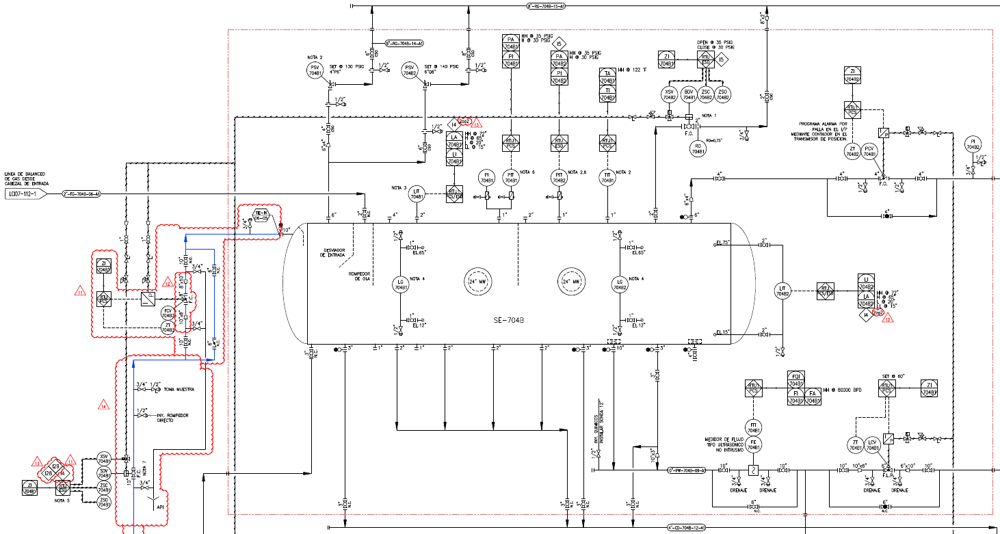

```{r setup, include=FALSE}
knitr::opts_chunk$set(echo = TRUE, comment = " ", fig.align = "center")
```

## INTRODUCCIÓN

En este documento se reportan los análisis y hallazgos relacionados con el estudio del separador SE704B localizado en la estación LCI07 del campo  La Cira-Infantas de Sierracol.

## DATOS DE ENTRADA

Para el estudio del equipo se importan los datos desde la aplicación TrendMiner, filtrando los instrumentos de los que se tienen disponibles señales:

<center>


</center>

* FCV-704B3: Porcentaje de apertura válvula de control de flujo de entrada al SE704B [%]
* PIT-704B3: Presión del fluido de entrada al SE704B [PSIG]
* LIT-704B1: Nivel en el SE704B, parte intermedia [inches]
* LIT-704B2: Nivel en el SE704B, salida [inches]
* PIT-704B1: Presión en el SE704B, parte intermedia [PSIG]
* PIT-704B2: Presión en el SE704B, salida [PSIG]
* FIT-704B1: Flujo de salida liquido en el SE704B [BPD]
* LCV-704B1: Porcentaje de apertura válvula de control de nivel del SE704B [%]
* LIT-701A: Nivel en el TK-701A ubicado aguas abajo de la válvula LCV-704B1 [ft]

Los datos importados son series temporales que inician el 3 de enero de 2021 a las 10:53 y terminan el 26 de enero de 2021 a las 00:06. La frecuencia de muestreo es de 1 minuto.

La información se almacena en un "dataframe" *df_ent* incluyendo la fecha como datos tipo POSIXct.

```{r, entradas, message=FALSE}
library(deSolve)
library(tidyverse)
df_ent_t<-read_csv("data_in3.csv")%>%
  rename("PIT-704B3"="99_99619_LCI07_SE704B_PIT-704B3_PV",
         "PIT-704B1"="99_99619_LCI07_SE704B_PIT-704B1_PV", 
         "LIT-704B1"= "99_99619_LCI07_SE704B_LIT-704B1_PV", 
         "LCV-704B1" = "99_99619_LCI07_P701G_LCV-704B1_PV", 
         "FIT-704B1" = "99_99619_LCI07_SE704B_FIT-704B1_PV",
         "LIT-704B2" = "99_99619_LCI07_SE704B_LIT-704B2_PV",
         "FCV-704B3" = "99_99619_LCI07_SE704B_FCV-704B3_ZT",
         "PIT-704B2" = "99_99619_LCI07_SE704B_PIT-704B2_PV",
         "LIT-701A" = "99_99619_LCI07_T701_LIT-701A_PV")%>%
  mutate(date = as.POSIXct(strptime(date, "%d-%m-%Y %H:%M:%S")))
```

Los datos se filtran de modo que no se tengan eventos operativos anómalos, se selecciona el intervalo de tiempo del 6-ene-21 18:43 hasta las 20:43 (2 horas)

```{r, filtro}
df_ent<-df_ent_t%>%
  filter(date > "2021-01-21 18:43:00" & date <= "2021-01-21 20:43:00")
```

Se establecen ademas los siguientes parámetros de entrada, relacionados con la geometría del tanque y otras constantes físicas y de conversión de unidades que serán usadas:

```{r, parametros, echo=TRUE}
rho<-61.856                   # densidad del fluido [lb/ft³]
Gf<-rho/62.4                  # Gravedad especifica del fluido [-]
R<-3.25                       # Radio del Separador SE704B [ft]
w<-22                         # Longitud del Separador SE704B [ft]
g<-32.17                      # Constante gravitacional [ft/s²]
K1 <- 0.000215839931747008    # Constante de conversión de lb/(ft*s²) a PSIG
K2 <- 0.133681                # Constante de conversión de GAL a ft³
```

## VALIDACIÓN DE DATOS

Adicionalmente a los datos extraídos del TrendMiner, se tiene información sobre la válvula de control. Toda la información debe ser validada para determinar si los análisis pueden ser confiables o si se requiere mas información.

### Medición de presión en el SE704B

Se examina la consistencia entre las dos mediciones de presión de que se dispone en el separador:

```{r, val_presion}
df_pre<-df_ent%>%
  select(`PIT-704B1`, `PIT-704B2`)
summary(df_pre)
print(paste0("Correlación de medición de presión: ", cor(df_pre$`PIT-704B1`, df_pre$`PIT-704B2`)))
```

Se observa que las dos mediciones son consistentes entre si ademas de tener una alta correlación entre las dos mediciones (por encima del 99%) por lo general las mediciones de presión son bastante confiables.

### Medición de nivel en el SE704B

Se examina la consistencia entre las dos mediciones de nivel de que se dispone en el separador:

```{r, val_nivel}
df_niv<-df_ent%>%
  select(`LIT-704B1`, `LIT-704B2`)
summary(df_niv)
print(paste0("Correlación de medición de nivel: ", cor(df_niv$`LIT-704B1`, df_niv$`LIT-704B2`)))
```

Se observa que las dos mediciones presentan algunas diferencias entre si, se tiene por lo general una diferencia de 0.5 pulgadas entre las dos mediciones, lo cual puede explicarse por la rejilla que separa las dos secciones del SE704B, la correlación es alta (96%), parecen mediciones consistentes con lo esperado del proceso.

### Validación del flujo de salida y válvula de control de nivel

La válvula de control de nivel LCV-704B1, según hoja de datos, tiene la siguiente curva Cv vs % Ap:

<center>


</center>

Se propone la creación de un modelo usando una regresión lineal con polinomios (hasta de 4to grado) para poder ser usado como parte de los demás cálculos. En el archivo separado por comas "LCV-704B.csv" se tabula la información de la figura 1 y a partir de este se desarrolla el modelo de la válvula.

```{r, mod_valvula, message=FALSE, fig.align='center', fig.cap="Figura 3"}
valv<-read_csv("LCV-704B1.csv")
valv<-valv%>%
  mutate(perc_ap2 = perc_ap^2, perc_ap3 = perc_ap^3, perc_ap4 = perc_ap^4)
mod_valv<-lm(Cv~., data = valv)
#Funcion para calcular el cv de la valvula dado el modelo
mod_v<-function(modelo, p_ap){
  p_aps<-c(rep(1, length(p_ap)), p_ap, p_ap^2, p_ap^3, p_ap^4)
  matrix(p_aps, nrow = 5, ncol = length(p_ap), byrow = T)
  m<-mod_valv$coefficients%*%matrix(p_aps, nrow = 5, ncol = length(p_ap), byrow = T)
  return(m)
}
p_ap<-seq(0, 1, 0.01)
plot(valv$perc_ap, valv$Cv, main = "Coeficiente de Flujo Vs % Apertura", xlab = "% Apertura", ylab = "Cv")
lines(p_ap, mod_v(mod_valv, p_ap), col = "red")
```

En rojo se observa la curva obtenida con la regresión, mientras que los puntos son los establecidos en el archivo "LCV-704B.csv". Se debe tener presente que la curva de la Figura 1 muestra *Cv vs Grados* (la válvula es rotativa), mientras que la Figura 2 muestra *Cv vs % Apertura*.

Para validar si el modelo de la válvula es consistente con los datos obtenidos de TM, se calculan los valores promedio del flujo de salida (FIT-704B1), presión en el separador (PIT-704B2), presión aguas abajo de la válvula (inferida de LIT-701A). Usando la ecuación:

\begin{equation}
\tag{1}
\Phi = Cv*\sqrt{\Delta P/Gf}
\end{equation}

En las siguientes lineas de código se calcula el Cv promedio de acuerdo con los datos de TM, es decir, del flujo de salida medido y las presiones aguas arriba y aguas abajo de la válvula se determina el Cv:

```{r, val_valvula1}
df_lcv<-df_ent%>%
  select(`PIT-704B2`, `LIT-701A`, `FIT-704B1`, `LCV-704B1`, `LIT-704B2`)%>%
  mutate(P_out=K1*rho*g*`LIT-701A`, F_out=42*`FIT-704B1`/(24*60), 
         `LCV-704B1` = `LCV-704B1`/100)
cv<-df_lcv$F_out*sqrt(Gf)/sqrt(df_lcv$`PIT-704B2`- df_lcv$P_out + K1*rho*g*df_lcv$`LIT-704B2`/12)
Delta_p_valve<-df_lcv$`PIT-704B2`- df_lcv$P_out + K1*rho*g*df_lcv$`LIT-704B2`/12
Pin_prom<-mean(df_lcv$`PIT-704B2`)
Pout_prom<-mean(df_lcv$P_out)
F_in_prom<-mean(df_lcv$F_out)
print(paste0("Cv promedio segun datos TM: ", mean(cv)))
print(paste0("Flujo promedio en la salida: ", F_in_prom, " GPM"))
print(paste0("Porcentaje de apertura promedio: ", 100*mean(df_lcv$`LCV-704B1`)))
print(paste0("Diferencial de presion promedio sobre la valvula: ", mean(Delta_p_valve), " PSI"))
print(paste0("presion de en SE704B promedio: ", Pin_prom, " PSIG"))
print(paste0("presion de salida de la valvula promedio: ", Pout_prom, " PSIG"))
```

Ahora se calcula el Cv de la válvula usando el modelo desarrollado de la válvula de control y los datos de porcentaje de apertura de la válvula de control:

```{r, val_valvula2}
cv_valv<-mod_v(mod_valv, df_lcv$`LCV-704B1`)
F_valv<-cv_valv*sqrt(df_lcv$`PIT-704B2`- df_lcv$P_out + K1*rho*g*df_lcv$`LIT-704B2`/12)/sqrt(Gf)
print(paste0("Cv promedio segun el modelo de la valvula: ", mean(cv_valv)))
print(paste0("Flujo promedio segun el modelo de la valvula: ", mean(F_valv), " Gal/Min"))
```

Los anteriores resultados sugieren que la válvula de control es muy distinta a la válvula especificada en la hoja de datos o que la información disponible sobre el flujo en la salida del separador no es fiable. 

La tecnología escogida para el medidor de flujo puede llevar a errores grandes dada la dificultad para establecer la velocidad del sonido en un fluido que puede ser potencialmente no-homogéneo y cambiante.

Por otro lado, es posible que por diferencias importantes entre las estimaciones de producción y los flujos de producción reales, la válvula hubiese sido mal seleccionada en la etapa de ingeniería y se hubiera requerido el cambio de la misma por una mas pequeña. Hay que tener en cuenta ademas la posibilidad de que entre la salida de la válvula y el punto de medición de presión (columna en el TK-701A) se tenga una caída de presión adicional representativa que cambie la caída de presión real sobre la válvula de control y por lo tanto el flujo.

Cualquiera de los casos anteriores o incluso ambos podrían haberse presentado. Para poder validar el modelo real de la válvula se requiere conocer la información de la curva Cv vs % Apertura de la válvula realmente instalada en campo y, ademas, verificar el flujo de salida haciendo un balance con el flujo de entrada y la acumulación en el separador, sin embargo, no se tiene una medición directa del flujo en la entrada, por lo que se tendría que inferir la misma de algún otro modo.

A las variables restantes (presión en el SE704B, presión aguas abajo de la LCV-704B1 y nivel en el SE704B) se les otorga mas crédito que a la medición de flujo porque son tecnologías menos susceptibles a errores en la medición.

### Válvula de control de flujo a la entrada

En la entrada del SE704B se tiene un lazo de control de flujo compuesto por la válvula FCV-704B3 y el FIT-704B1 (flujo de salida). El objetivo de este lazo es regular el flujo de salida en 50 mil BPD controlando el flujo en la entrada. 

```{r, val_valvula3, fig.align='center', fig.cap="Figura 4"}
par(mfrow=c(2,1))
plot(df_ent$date, df_ent$`FCV-704B3`, main = "Porcentaje de apertura de la FCV-704B3", type = "l", ylab = "% Apertura", xlab = "tiempo")
abline(h=mean(df_ent$`FCV-704B3`), col = "red")
plot(df_ent$date, df_ent$`FIT-704B1`, main = "Flujo a la salida de SE704B", type = "l", ylab = "Flujo [BPD]", xlab = "tiempo")
abline(h=mean(df_ent$`FIT-704B1`), col = "red")
```

En la figura 4 se observa que la válvula FCV-704B3 permanece completamente abierta todo el tiempo, lo cual se explica porque el lazo de control tiene un set de flujo de salida de 50 mil BPD mientras que el flujo medido es tan solo de 28 mil, esto obliga a la válvula a abrirse mas para admitir mas flujo en la entrada, sin embargo, dado que no se esta produciendo mas que eso, el flujo no puede aumentar aunque la válvula este completamente abierta.

De la FCV-704B3 es posible inferir el flujo de entrada, dado que tenemos información de la caída de presión (PIT-704B3 y PIT-704B1) y el porcentaje de apertura (100%), lo único que debemos tener es el Cv de la válvula cuando esta abierta al 100%. Asumiendo que lo propuesto en el P&ID es real, la FCV-704B3 es una válvula mariposa de 8 pulgadas, si es de la misma serie que la válvula de salida (A41 de Fisher) entonces el Cv es 2180 al 100% de apertura. Usando la ecuación (1), tenemos que:

```{r, val_valvula4}
df_lcv2<-df_ent%>%
  select(date, `PIT-704B3`, `PIT-704B1`)
Delta_p_ent<-df_lcv2$`PIT-704B3`- df_lcv2$`PIT-704B1`
F_valv2<-2180*sqrt(Delta_p_ent)/sqrt(Gf)
print(paste0("Caida de presion en la valvula: ", mean(Delta_p_ent), " [PSI]"))
print(paste0("Flujo promedio de entrada según datos de la válvula: ", mean(24*60*F_valv2/42), " [BPD]"))
```

Lo cual es inconsistente con los datos medidos por el FIT-704B1 y con lo calculado con el modelo. Se pueden tener varias explicaciones:

1. La válvula realmente instalada no es del tamaño o de las características asumidas.
2. Existe algún elemento de caída de presión que no ha sido tenido en cuenta.
3. El segmento de tubería entre las mediciones es muy extenso de manera que la caída de presión en la válvula es en realidad mucho menor a la usada en el calculo.

Para los casos 2 y 3 la validación usando la información de la diferencia de presión pierde credibilidad porque ya no es fácil determinar la proporción de caída de presión que le corresponde a cada elemento.

## MODELO TEÓRICO DEL SE704B

Para poder simular la dinámica del separador y conocer el funcionamiento del equipo, se desarrolla un modelo teórico de la dinámica del separador. Se hace uso de los parámetros establecidos en la sección DATOS DE ENTRADA.

Se inicia estableciendo el balance de masa del sistema:

\begin{equation}
\tag{2}
\int_{0}^{t_{f}}\Phi_{Ment}(t)dt = \int_{0}^{t_{f}}\Phi_{Msal}(t)dt + \Delta M
\end{equation}

Asumiendo que el cambio en la densidad del fluido de entrada y salida es despreciable y calculando al derivada se puede re-escribrir (2) como:

\begin{equation}
\tag{3}
\Phi_{Vent}(t) = \Phi_{Vsal}(t) + \frac{dV(t)}{dt}
\end{equation}

El volumen se define con la ecuación (4)

\begin{equation}
\tag{4}
V = \frac{w R^2}{2} (\theta - sin(\theta)) \\
\theta = 2 acos(y) \\
y = 1-\frac{l}{R}
\end{equation}

donde $l$ es el nivel en el separador SE704B como función del tiempo. La derivada del volumen queda como:

\begin{equation}
\tag{5}
\frac{dV(t)}{dt} = 2 w R \sqrt{\frac{2l}{R}+\frac{l^2}{R^2}} \frac{dl}{dt}
\end{equation}

Por su parte, el flujo de salida a través de la válvula LCV-704B1 se expresa como:

\begin{equation}
\tag{6}
\Phi_{Vsal} = \frac{Cv}{\sqrt{Gf}} \sqrt{P_{in}-P_{out}+K_1 \rho g l}
\end{equation}

Reemplazando (5) y (6) en (3) y despejando la derivada del nivel, se encuentra:

\begin{equation}
\tag{7}
\frac{dl}{dt} = \left[\frac{\sqrt{Gf} \Phi_{Vent} - Cv \sqrt{P_{in}-P_{out}+K_1 \rho g l}}{2 w R \sqrt{Gf} \sqrt{\frac{2l}{R}+\frac{l^2}{R^2}}} \right] K_2
\end{equation}

Siendo (7) la ecuación diferencial que rige la dinámica del sistema. En la notación usada no se puso explicitamente la dependencia con el tiempo de las variables, sin embargo, para mayor claridad, se define que $P_{in}$, $P_{out}$, $\Phi_{Vent}$ y $Cv$ son variables de entrada al sistema y son dependientes del tiempo, mientras que $l$ es la variable de salida, también dependiente del tiempo.

Las constantes $K_1$ y $K_2$ se usan para asegurar la consistencia de unidades, que se definen como: $P_{in}$ y $P_{out}$ en PSIG, $\Phi_{Vent}$ en Gal/min, $Cv$ adimensional y $l$ en ft.

### Singularidades y estado estable
 
Dada la ecuación (7) podemos entender qué puntos de operación son importantes en la dinámica del sistema, nótese que (7) es una fracción por lo que es de interés saber en donde el denominador tiende a cero porque la derivada del nivel tenderá a infinito. Para esto tenemos que:

$$\sqrt{\frac{2l}{R}+\frac{l^2}{R^2}} = \sqrt{l}*\sqrt{2-\frac{l}{R}} = 0$$
Entonces

$$\frac{dl}{dt} \to \infty$$
si:

$$l \to 0$$ 
$$l \to 2R$$

Esto nos indica que cuando el valor del nivel del recipiente se acerca a cero o al diámetro del separador la derivada del nivel va a aumentar muy rapidamente, por lo que no se recomienda operar cerca de ninguno de estos dos extremos.

Por otro lado el estado estable del sistema ocurre cuando la derivada del nivel es cero, o lo que es lo mismo, cuando el numerador de (7) es igual a cero, esto nos lleva a:

\begin{equation}
\tag{8}
l_{estable}=\frac{1}{K_1 \rho g} \left(Gf \frac{\Phi_{Vent}^2}{Cv^2}-P_{in}+P_{out}\right)
\end{equation}

Si la diferencia de presión se mantiene constante o cambia poco, se espera que el nivel de estado estable dependa principalmente de la relación entre el $Cv$ y $\Phi_{Vent}$ a cambios en el flujo de entrada, si la válvula actúa compensando el cambio, el nivel podría mantenerse en el mismo punto.

### Simulaciones de lazo abierto

Se define el modelo del sistema y se resuelve (integra) la ecuación diferencial usando los valores promedio del sistema (P_in = `r round(Pin_prom, 2)` PSIG, P_out = `r round(Pout_prom, 2)` PSIG, Cv = `r round(mean(cv), 2)`) adicionalmente se define que el flujo de entrada promedio sea igual al flujo de salida promedio `r F_in_prom` GPM, esto ultimo será cierto para cuando el sistema llegue a estado estable, dada una entrada de flujo constante.


```{r, def_mod}
# Definición del modelo
SE704B1<-function(t, x, parms){
  with(as.list(c(parms, x)), {
    f_in<-Func_f_in(t)
    area <- 2*w*R*sqrt(2*l/R-(l/R)^2)
    f_out <- Cv*sqrt(Pin-Pout+k1*rho*g*l)/sqrt(Gf)
    dl <- k2*(f_in-f_out)/area
    return(list(dl, f_in, area, f_out))
  })
}
```

#### Simulación de vaciado

Primero se hace simulación de vaciado del SE704B para verificar coherencia: 

```{r, sim_vaciado}
# Definición del tiempo de simulación
times<-times<-seq(0, 6.58, 0.01)
# Definición del flujo de entrada
F_in<-42*c(0, 0)/(24*60)
t<-c(0, 6.58)
# La función approxfun convierte los puntos de los datos de F_in en una función interpolando los puntos
Func_f_in<-approxfun(t, F_in, rule = 2)

# Definición de parámetros de entrada
parms <- c(Gf = Gf, Pin = Pin_prom, Pout = Pout_prom, rho = rho, g = g, 
           k1 = K1, w = w, R = R, Cv = mean(cv), k2 = K2)

#Definición de las condiciones iniciales recipiente lleno
xstart <- c(l = 6.49)

#Integración de la ecuación diferencial con condiciones iniciales
out <- ode(y = xstart, times = times,  func = SE704B1, parms)
plot(out[, 1], out[, 2], type = "l", main = "Vaciado de recipiente", xlab = "Tiempo [min]", ylab = "Nivel [ft]")
plot(out)
```

Se observa que la forma que toma el sistema es casi lineal a excepción de los extremos en donde se nota el incremento de la pendiente con la que se desocupa el recipiente. El tiempo que le toma es de aproximadamente 6.58 minutos. Teniendo en cuenta que un Cv de la válvula de `r round(mean(cv), 2)` corresponde a un flujo de `r round(227*sqrt((16.8-4.12)/Gf), 2)` GPM si despreciamos el efecto de la columna de liquido en el recipiente, y el volumen total del recipiente es `r round(pi*R^2*w/K2, 2)` Galones, le tomaría `r round((pi*R^2*w/K2)/(227*sqrt((16.8-4.12)/Gf)), 2)` minutos.

#### Simulacion del comportamiento con entradas

Simulemos ahora el sistema con la entrada de flujo promedio y el Cv promedio establecidos en la sección de Validación del flujo de salida, calculemos primero el nivel de estado estable y comparemos con el nivel promedio del recipiente:

```{r sim_entr_prom1}

l_est<-(Gf*(F_in_prom/mean(cv))^2-Pin_prom+Pout_prom)/(K1*rho*g)
print(paste0("el nivel estable segun el modelo para el cv y flujo de entrada promedio es: ", l_est, " ft"))
print(paste0("el nivel promedio segun TM: ", mean(df_ent$`LIT-704B2`/12), " ft"))
```

Haciendo la simulación se tiene:

```{r}
# Definición del tiempo de simulación
times<-times<-seq(0, 400, 0.01)
# Definición del flujo de entrada
F_in<-c(F_in_prom, F_in_prom)
t<-c(0, 400)
# La función approxfun convierte los puntos de los datos de F_in en una función interpolando los puntos
Func_f_in<-approxfun(t, F_in, rule = 2)

# Definición de parámetros de entrada
parms <- c(Gf = Gf, Pin = Pin_prom, Pout = Pout_prom, rho = rho, g = g, 
           k1 = K1, w = w, R = R, Cv = mean(cv), k2 = K2)

#Definición de las condiciones iniciales recipiente con nivel a 1 ft
xstart <- c(l = 1)

#Integración de la ecuación diferencial con condiciones iniciales
out <- ode(y = xstart, times = times,  func = SE704B1, parms)
plot(out[,1], out[,2], type = "l", main = "Estado estable", xlab = "Tiempo [min]", ylab = "Nivel [ft]")
abline(h=l_est, col = "red")
plot(out)
```

### Simulaciones de lazo cerrado

Se incluye en el modelo ahora el lazo de control, se inicia usando solo control proporcional y luego se introduce acción integral.

#### Control proporcional

Para el desarrollo del modelo con control, se debe definir el comportamiento del coeficiente de flujo de la válvula vs el porcentaje de apertura, con el fin de continuar con el ejercicio, se va a asumir que la válvula instalada es la que tenemos de las hojas de datos, la diferencia que vamos a tener con los datos de TM es que para conseguir los flujos (Cv) requeridos para el control, el porcentaje de apertura deberan ser menores.

Para el desarrollo del modelo con control proporcional se incluye el comportamiento como si el Cv de la válvula fuera una función del tiempo que se gobierna en respuesta a una señal de error que se define como:

$$ error = l(t) - set $$

Y la acción de control sería:

$$ Ap_{valv} = bias + Kp*error $$

En donde el bias es la apertura de la válvula para las condiciones normales de operación, si definimos que la operación observada en TM es la operación normal, entonces $ bias = Ap_{valv} $ para el cual el Cv sea `r round(mean(cv), 2)` de la Figura 9 se observa

```{r, bias}
p_ap<-seq(0, 1, 0.001)
cv_asum<-t(mod_v(mod_valv, p_ap))
bias<-p_ap[which(cv_asum>=mean(cv))[1]]
plot(p_ap, cv_asum, type = "l", main = "Coeficiente de Flujo Vs % Apertura", xlab = "% Apertura", ylab = "Cv")
abline(h=mean(cv), col = "red")
abline(v = bias, col= "red")
print(paste0("El bias para operación normal en cv de ", mean(cv), " es: ", 100*bias, "% de apertura"))
```

Adicional a lo anterior, hay que tener en cuenta que el modelo de la válvula no es completamente exacto, por ejemplo, en 0 y 0.1 el cv calculado por el modelo es negativo, lo cual no tiene sentido. Por otro lado, para valores de porcentajes de apertura mayores a 100% el modelo va a predecir algún valor, pero esto no tiene sentido tampoco por la válvula no puede aumentar su coeficiente de flujo mas allá del 100% de apertura.

Se modifica la función de predicción del Cv para ajustarlo a los requerimientos del modelo:

```{r, mod_valv2}
mod_v2<-function(modelo, p_ap){
  p_aps<-c(1, p_ap, p_ap^2, p_ap^3, p_ap^4)
  cv_din<-mod_valv$coefficients%*%p_aps
  if(cv_din<0){
    cv_out<-0
  }
  if(cv_din>1250){
    cv_out<-1250
  }
  if(cv_din>=0 & cv_din<=1250){
    cv_out<-cv_din
  }
  return(cv_out)
}
```

Con esta nueva función para predecir el cv, se define el modelo como:

```{r, mod_cntr_prop}
SE704B2<-function(t, x, parms){
  with(as.list(c(parms, x)), {
    f_in<-Func_f_in(t)
    p_ap<-bias+kp*(l-set)
    Cv<-mod_v2(mod_valv, p_ap)
    dl <- k2*(sqrt(Gf)*f_in-Cv*sqrt(Pin-Pout+rho*g*k1*l))/(2*w*R*sqrt(Gf*(2*l/R-l^2/R^2)))
    return(list(dl, f_in, Cv, p_ap))
  })
}
```

Podemos ahora simular el funcionamiento del sistema con control proporcional con una entrada constante operativa de 830.57 GPM y un set de 45 pulgadas de nivel o 3.75 ft

```{r, sim_cnt_p1}
# Definición del tiempo de simulación
times<-times<-seq(0, 10, 0.01)
# Definición del flujo de entrada
F_in<-c(F_in_prom, F_in_prom)
t<-c(0, 10)
# La función approxfun convierte los puntos de los datos de F_in en una función interpolando los puntos
Func_f_in<-approxfun(t, F_in, rule = 2)
parms <- c(Gf = Gf, Pin = Pin_prom, Pout = Pout_prom, rho = rho, g = g, k1 = K1, 
           w = w, R = R, k2 = K2, bias = bias, set = 3.75, kp = 1.1)
xstart <- c(l = 3)
out <- ode(y = xstart, times = times,  func = SE704B2, parms)
par(mfrow=c(1, 2))
plot(out[,1], out[,2], "l", main = "Nivel", ylab = "l [ft]", xlab = "Tiempo")
abline(h= 3.75, col = "red")
plot(out[,1], out[,3], "l", main = "Flujo de entrada", ylab = "F_in [GPM]", xlab = "Tiempo")
plot(out[,1], out[,4], "l", main = "CV", ylab = "CV", xlab = "Tiempo")
plot(out[,1], 100*out[,5], "l", main = "p_ap", ylab = "p_apertura [%]", xlab = "Tiempo")
```

Ahora vamos a simular entradas paso de 100 GPM adicionales y luego de -100 GPM a la entrada de operación normal (es decir 930.57 y 730.57 GPM), en las condiciones iniciales asumiendo que ya esta en estado estable:

```{r, sim_cnt_p2}
# Definición del tiempo de simulación
times<-times<-seq(0, 12, 0.01)
# Definición del flujo de entrada
F_in<-c(F_in_prom, F_in_prom, F_in_prom+100, F_in_prom+100, F_in_prom-100, F_in_prom-100, F_in_prom, F_in_prom)
t<-c(0, 2, 2.01, 6, 6.01, 10, 10.01, 12)
# La función approxfun convierte los puntos de los datos de F_in en una función interpolando los puntos
Func_f_in<-approxfun(t, F_in, rule = 2)
parms <- c(Gf = Gf, Pin = Pin_prom, Pout = Pout_prom, rho = rho, g = g, k1 = K1, 
           w = w, R = R, k2 = K2, bias = bias, set = 3.75, kp = 1.1)
xstart <- c(l = 3.75)
out <- ode(y = xstart, times = times,  func = SE704B2, parms)
par(mfrow=c(1, 2))
plot(out[,1], out[,2], "l", main = "Nivel", ylab = "l [ft]", xlab = "Tiempo")
abline(h= 3.75, col = "red")
plot(out[,1], out[,3], "l", main = "Flujo de entrada", ylab = "F_in [GPM]", xlab = "Tiempo")
plot(out[,1], out[,4], "l", main = "CV", ylab = "CV", xlab = "Tiempo")
plot(out[,1], 100*out[,5], "l", main = "p_ap", ylab = "p_apertura [%]", xlab = "Tiempo")
```

Se observan pequeñas variaciones alrededor del nivel de set del lazo de control, lo cual es consistente con el comportamiento de un lazo de control proporcional en el que se tiene un offset siempre, que va aumentando conforme el flujo de entrada se va alejando del flujo operativo normal para el cual fue diseñado el sistema.

#### Control proporcional + integral

La ley de control se modifica para incluir la acción integral, lo cual se define como:

$$ Ap_{valv} = bias + Kp*error + \frac{Kp}{\tau_i } \int_0^t error(t) dt$$
La integral se define como una nueva ecuación diferencial de estado dentro del sistema ya establecido, en definitiva el sistema nos queda como:

```{r, mod_cntr_int}
SE704B3<-function(t, x, parms){
  with(as.list(c(parms, x)), {
    f_in<-Func_f_in(t)
    die<-l-set                    #die se refiere a la derivada de la integral del error, es decir, el error
    p_ap<-bias+kp*die+(kp/Ti)*ie  #ie se refiere a la integral del error
    Cv<-mod_v2(mod_valv, p_ap)
    dl <- k2*(sqrt(Gf)*f_in-Cv*sqrt(Pin-Pout+rho*g*k1*l))/(2*w*R*sqrt(Gf*(2*l/R-l^2/R^2)))
    res <- list(die, dl)
    return(list(res, f_in, Cv, p_ap))
  })
}
```

Procedemos a simular ahora usando un $\tau_i$ de `r 1.1/0.015`, que es el que esta configurado en el sistema de control actual:

```{r, sim_cnt_i1}
# Definición del tiempo de simulación
times<-times<-seq(0, 10, 0.01)
# Definición del flujo de entrada
F_in<-c(F_in_prom, F_in_prom)
t<-c(0, 10)
# La función approxfun convierte los puntos de los datos de F_in en una función interpolando los puntos
Func_f_in<-approxfun(t, F_in, rule = 2)
parms <- c(Gf = Gf, Pin = Pin_prom, Pout = Pout_prom, rho = rho, g = g, k1 = K1, 
           w = w, R = R, k2 = K2, bias = bias, set = 3.75, kp = 1.1, Ti = 1.1/0.015)
xstart <- c(ie = 0, l = 3)
out <- ode(y = xstart, times = times,  func = SE704B3, parms)
par(mfrow=c(1, 2))
plot(out[,1], out[,2], "l", main = "Integral del error", ylab = "Integral error [ft*min]", xlab = "Tiempo")
plot(out[,1], out[,3], "l", main = "Nivel", ylab = "l [ft]", xlab = "Tiempo")
abline(h= 3.75, col = "red")
plot(out[,1], out[,4], "l", main = "Flujo de entrada", ylab = "F_in [GPM]", xlab = "Tiempo")
plot(out[,1], out[,5], "l", main = "CV", ylab = "CV", xlab = "Tiempo")
```

Simulando ahora la entrada que se tenia en el caso de control proporcional se obtiene:

```{r, sim_cnt_i2}
# Definición del tiempo de simulación
times<-times<-seq(0, 12, 0.01)
# Definición del flujo de entrada
F_in<-c(F_in_prom, F_in_prom, F_in_prom+100, F_in_prom+100, F_in_prom-100, F_in_prom-100, F_in_prom, F_in_prom)
t<-c(0, 2, 2.01, 6, 6.01, 10, 10.01, 12)
# La función approxfun convierte los puntos de los datos de F_in en una función interpolando los puntos
Func_f_in<-approxfun(t, F_in, rule = 2)
parms <- c(Gf = Gf, Pin = Pin_prom, Pout = Pout_prom, rho = rho, g = g, k1 = K1, 
           w = w, R = R, k2 = K2, bias = bias, set = 3.75, kp = 1.1, Ti = 1.1/0.015)
xstart <- c(ie = 0, l = 3.75)
out <- ode(y = xstart, times = times,  func = SE704B3, parms)
par(mfrow=c(1, 2))
plot(out[,1], out[,2], "l", main = "Integral del error", ylab = "Integral error [ft*min]", xlab = "Tiempo")
plot(out[,1], out[,3], "l", main = "Nivel", ylab = "l [ft]", xlab = "Tiempo")
abline(h= 3.75, col = "red")
plot(out[,1], out[,4], "l", main = "Flujo de entrada", ylab = "F_in [GPM]", xlab = "Tiempo")
plot(out[,1], out[,5], "l", main = "CV", ylab = "CV", xlab = "Tiempo")
```

En la gráfica de nivel se observa que el sistema de control intenta corregir y llevar la señal hacia el set, pero el tiempo de la accion integral es tal alto que el efecto es muy pequeño.

A continuación se disminuye el tiempo integral para observar el comportamiento del sistema:

```{r, sim_cnt_i3}
# Definición del tiempo de simulación
times<-times<-seq(0, 12, 0.01)
# Definición del flujo de entrada
F_in<-c(F_in_prom, F_in_prom, F_in_prom+100, F_in_prom+100, F_in_prom-100, F_in_prom-100, F_in_prom, F_in_prom)
t<-c(0, 2, 2.01, 6, 6.01, 10, 10.01, 12)
# La función approxfun convierte los puntos de los datos de F_in en una función interpolando los puntos
Func_f_in<-approxfun(t, F_in, rule = 2)
parms <- c(Gf = Gf, Pin = Pin_prom, Pout = Pout_prom, rho = rho, g = g, k1 = K1, 
           w = w, R = R, k2 = K2, bias = bias, set = 3.75, kp = 1.1, Ti = 1.1/0.3)
xstart <- c(ie = 0, l = 3.75)
out <- ode(y = xstart, times = times,  func = SE704B3, parms)
par(mfrow=c(1, 2))
plot(out[,1], out[,2], "l", main = "Integral del error", ylab = "Integral error [ft*min]", xlab = "Tiempo")
plot(out[,1], out[,3], "l", main = "Nivel", ylab = "l [ft]", xlab = "Tiempo")
abline(h= 3.75, col = "red")
```

El efecto es ahora mucho mas notorio, si no se introduce la ultima perturbación la evolución de nivel es como se muestra a continuación:

```{r, sim_cnt_i4}
# Definición del tiempo de simulación
times<-times<-seq(0, 20, 0.01)
# Definición del flujo de entrada
F_in<-c(F_in_prom, F_in_prom, F_in_prom+100, F_in_prom+100)
t<-c(0, 2, 2.01, 20)
# La función approxfun convierte los puntos de los datos de F_in en una función interpolando los puntos
Func_f_in<-approxfun(t, F_in, rule = 2)
parms <- c(Gf = Gf, Pin = Pin_prom, Pout = Pout_prom, rho = rho, g = g, k1 = K1, 
           w = w, R = R, k2 = K2, bias = bias, set = 3.75, kp = 1.1, Ti = 1.1/0.3)
xstart <- c(ie = 0, l = 3.75)
out <- ode(y = xstart, times = times,  func = SE704B3, parms)
par(mfrow=c(1, 1))
plot(out[,1], out[,3], "l", main = "Nivel", ylab = "l [ft]", xlab = "Tiempo")
abline(h= 3.75, col = "red")
```

### Simulaciones con flujo de entrada inferido de TrenMiner

Dado que el modelo desarrollado usa como entrada el flujo de entrada, vamos a calcular un flujo de entrada dado el flujo de salida y la acumulación en el recipiente, partiendo de (7) tenemos que:

\begin{equation}
\tag{9}
\Phi_{Vent}= 2 w R \sqrt{Gf} \sqrt{\frac{2l}{R}+\frac{l^2}{R^2}} \frac{\Delta l}{\Delta t} + \Phi_{Vout}
\end{equation}

En este caso la derivada del nivel se reemplaza por la pendiente calculada en intervalos de 1 minuto. Se calcula el flujo de entrada según (9):

```{r}
Delta_l<-(df_ent$`LIT-704B1`[2:nrow(df_ent)]-df_ent$`LIT-704B1`[1:(nrow(df_ent)-1)])/12
l_vec<-df_ent$`LIT-704B1`[1:(nrow(df_ent)-1)]/12
F_in<-(2*w*R*sqrt(Gf*(2*l_vec/R-l_vec^2/R^2))*Delta_l/K2+df_ent$`FIT-704B1`[1:(nrow(df_ent)-1)]*42/(24*60))
acum<-2*w*R*sqrt(Gf*(2*l_vec/R-l_vec^2/R^2))*Delta_l/K2
F_out<-df_ent$`FIT-704B1`[1:(nrow(df_ent)-1)]*42/(24*60)
test1<-tibble(F_in = F_in, acum = acum, F_out = F_out, Delta_l, Delta_l_in = Delta_l*12, l_vec)
```

Con *F_in* calculado en GPM. Se hace la simulación ahora usando esta señal de entrada:

```{r, sim_cnt_i5}
# Definición del tiempo de simulación
times<-seq(0, 119, 0.01)
# Definición del flujo de entrada
# La función approxfun convierte los puntos de los datos de F_in en una función interpolando los puntos
Func_f_in<-approxfun(F_in, rule = 2)
Func_l<-approxfun(df_ent$`LIT-704B1`[1:(nrow(df_ent)-1)]/12, rule = 2)
parms <- c(Gf = Gf, Pin = Pin_prom, Pout = Pout_prom, rho = rho, g = g, k1 = K1, 
           w = w, R = R, k2 = K2, bias = bias, set = 40/12, kp = 1.1, Ti = 1.1/0.015)
xstart <- c(ie = 0, l = 40/12)
out <- ode(y = xstart, times = times,  func = SE704B3, parms)
plot(out[,1], out[,3], type = "l", main = "Nivel", ylab = "l [ft]", xlab = "Tiempo")
sim<-out[,3]
times2<-seq(0, 119, 0.01)
real<- Func_l(times2)
cor(sim, real)
plot(out[,1], Func_l(times2), col = "red", type = "l", main = "Nivel", ylab = "l [ft]", xlab = "Tiempo")
lines(out[,1], out[,3], col = "black")
print(paste0("media del nivel medido: ", 12*mean(Func_l(times2))))
print(paste0("media del nivel simulado: ", 12*mean(out[,3])))
```

### Simulación con los datos disponibles de TrendMiner

Se ajusta el modelo para admitir las entradas de TM

```{r, mod_completo}
SE704B4<-function(t, x, parms){
  with(as.list(c(parms, x)), {
    f_in<-Func_f_in(t)
    Pin<-Func_p_in(t)
    Pout<-Func_p_out(t)
    die<-l-set                    #die se refiere a la derivada de la integral del error, es decir, el error
    p_ap<-bias+kp*die+(kp/Ti)*ie  #ie se refiere a la integral del error
    Cv<-mod_v2(mod_valv, p_ap)
    dl <- k2*(sqrt(Gf)*f_in-Cv*sqrt(Pin-Pout+rho*g*k1*l))/(2*w*R*sqrt(Gf*(2*l/R-l^2/R^2)))
    res <- list(die, dl)
    return(list(res, f_in, Pin, Pout, Cv, p_ap))
  })
}
```

Se hace la simulación con los datos completos:

```{r, sim_cmplt1}
# Definición del tiempo de simulación
times<-seq(1, 119, 0.01)
# Definición del flujo de entrada
# La función approxfun convierte los puntos de los datos de F_in en una función interpolando los puntos
Func_f_in<-approxfun(F_in, rule = 2)
Func_p_in<-approxfun(df_ent$`PIT-704B2`[1:(nrow(df_ent)-1)], rule = 2)
Func_p_out<-approxfun(K1*rho*g*df_ent$`LIT-701A`[1:(nrow(df_ent)-1)]+1.2, rule = 2)
Func_l<-approxfun(df_ent$`LIT-704B1`[1:(nrow(df_ent)-1)]/12, rule = 2)
parms <- c(Gf = Gf, rho = rho, g = g, k1 = K1, w = w, R = R, k2 = K2, bias = bias, 
           set = 40/12, kp = 1.1, Ti = 1.1/0.015)
xstart <- c(ie = 0, l = 40/12)
out <- ode(y = xstart, times = times,  func = SE704B4, parms)
sim<-out[,3]
times2<-seq(1, 119, 0.01)
real<- Func_l(times2)
cor(sim, real)
plot(out[,1], Func_l(times2), col = "red", type = "l", main = "Nivel", ylab = "l [ft]", xlab = "Tiempo")
lines(out[,1], out[,3], col = "black")
print(paste0("media del nivel medido: ", 12*mean(Func_l(times2))))
print(paste0("media del nivel simulado: ", 12*mean(out[,3])))
```